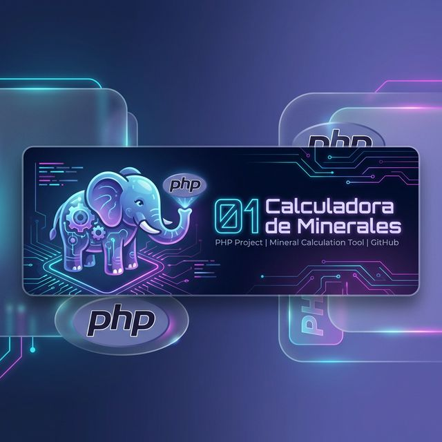

# Proyecto 01: Calculadora de Minerales v1.0 (Premium Edition)

Una aplicación web moderna y profesional construida con **PHP 8.5**, siguiendo principios de **Clean Architecture** y un diseño **Glassmorphism** de alta gama.

## ✨ Características Premium

- **Diseño Glassmorphism**: Interfaz translúcida con fondo animado (gradiente oficial de PHP).
- **Iconografía Profesional**: Uso de Phosphor Icons y emojis conceptuales para cada mineral.
    - 📦 Estaño (Sn)
    - 🏗️ Zinc (Zn)
    - 🪙 Plata (Ag)
    - ⚜️ Oro (Au)
- **Historial Inteligente**:
    - Registro automático de cálculos en sesión.
    - Sin duplicados (el resultado actual no se repite en la lista).
    - Persistencia entre recargas.
    - Botón para **Borrar Historial**.
- **UX Refinada**:
    - Limpieza automática de inputs tras calcular.
    - Redirección post-cálculo (PRG Pattern) para evitar reenvíos de formularios al recargar.
    - Validaciones robustas en servidor.

## 📂 Estructura del Proyecto (PSR)

- `public/`: **Web Root**. Contiene `index.php`, `css/style.css` y `js/script.js`.
- `bin/`: **CLI**. Script de consola `cli.php` para ejecuciones rápidas.
- `src/`: **Core**. Lógica de negocio pura (`CalculatorService`, `MineralType`).

## 🚀 Cómo ejecutar

### Versión Web
1. Navega a la carpeta del proyecto:
```bash
cd 01_calculadora_minerales
```
2. Inicia el servidor PHP (apuntando a `public`):
```bash
php -S localhost:8000 -t public
```
3. Abre en tu navegador: [http://localhost:8000](http://localhost:8000)

### Versión Consola
```bash
php 01_calculadora_minerales/bin/cli.php
```

---
**Tecnologías:** PHP 8.5 • HTML5 • CSS3 (Variables, Animations) • Phosphor Icons
