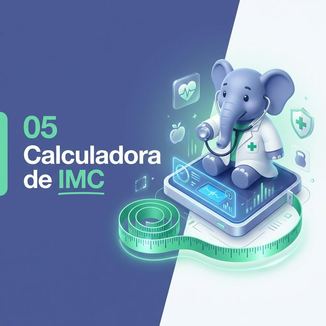

# 05 Calculadora de IMC | PHP 8.5 Health App

> **Tu Salud en Código Strict-Type**
> Una aplicación precisa para el cálculo del Índice de Masa Corporal, demostrando las capacidades modernas de PHP 8.

## 🩺 Descripción

La **Calculadora de IMC** es el quinto proyecto de la serie. Más allá de su utilidad médica, este proyecto sirve como demostración técnica de la **validación de tipos** y las nuevas sintaxis de **PHP 8.5**.

El diseño visual abandona el estilo "Fintech" de los proyectos anteriores para adoptar una estética "HealthTech" limpia, utilizando la paleta de colores oficial de PHP (Azul Elefante) para transmitir confianza y estabilidad.

---

## 🚀 Innovaciones PHP 8.5

### 1. Constructor Property Promotion
En lugar de declarar propiedades y asignarlas manualmente, usamos la sintaxis corta en el DTO `Person`:
```php
public function __construct(
    public float $weight,
    public int $height
) {}
```

### 2. Match Expressions
Sustituimos los largos bloques `switch` o `if/else` por expresiones `match` más limpias y estrictas para el diagnóstico médico:
```php
$diagnosis = match (true) {
    $bmi < 18.5 => ['color' => 'blue', ...],
    $bmi < 24.9 => ['color' => 'green', ...],
    ...
};
```

### 3. Strict Typing
Todo el proyecto corre bajo `declare(strict_types=1)`, asegurando que no haya conversiones de datos mágicas e inseguras.

---

## 🛠️ Tecnologías

*   **Lenguaje:** PHP 8.5
*   **Diseño:** CSS Variables (PHP Palette: `#4F5B93`)
*   **Fuentes:** Google Fonts 'Outfit'
*   **Iconos:** Phosphor Icons (Medical Set)

---

## 📦 Estructura

```
05_calculadora_imc/
├── assets/
│   └── banner_calculadora_imc.png
├── public/
│   └── index.php          # Interfaz Principal
├── src/
│   ├── Classes/
│   │   └── Person.php     # DTO (Data Transfer Object)
│   └── Services/
│       └── BMIService.php # Lógica de Negocio
└── README.md
```

---

## ⚡ Cómo Ejecutar

1. Inicia el servidor interno:
```bash
php -S localhost:8082 -t public
```
2. Visita `http://localhost:8082`.
3. Ingresa tus datos para obtener tu diagnóstico.

---

**php8-masterclass-portfolio • Proyecto 05**
