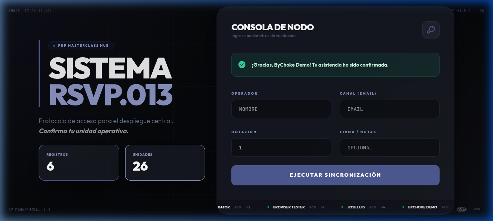

# 🏁 Proyecto 13: Recepción de RSVP Premium
> **Consola de Nodo Industrial | Persistencia JSON & PHP 8.5 Inmutable**



## 🏗️ Concepto
Este proyecto implementa una terminal de recepción de asistencia (RSVP) diseñada bajo una estética **Industrial Compacta**. El objetivo es demostrar la capacidad de PHP 8.5 para manejar persistencia de datos ligera (JSON) garantizando la integridad mediante el uso de objetos inmutables y tipado estricto.

## 🚀 Características Técnicas
- **Persistencia Atómica**: Almacenamiento y recuperación dinámica de datos desde `reservations.json`.
- **Patrón PRG (Post/Redirect/Get)**: Implementación de flujo de envío seguro para evitar re-sumisión de formularios al recargar.
- **Validación Robusta**: Uso de un modelo centralizado `RSVP` que valida datos (email, cantidad de acompañantes) en el constructor.
- **Dashboard en Vivo**: Contadores automáticos de registros y unidades operativas totales procesadas.

## 🐘 PHP 8.5 Masterclass Features
- ✅ `readonly class`: Para garantizar que los registros de invitados sean inmutables una vez creados.
- ✅ **Constructor Property Promotion**: Código más limpio y declarativo.
- ✅ **Strict Types**: `declare(strict_types=1)` para eliminar ambigüedades en el flujo de datos.
- ✅ **JSON Serialization**: Implementación nativa de `json_encode` y `json_decode` para persistencia persistente.

## 🎨 Filosofía de Diseño: "Compact Industrial"
- **Paleta Oficial PHP**: Uso prioritario de ElePHPant Blue (`#4F5B93`) y Dark Slate.
- **Formato 100vh**: Interfaz diseñada para ser totalmente visible en un solo vistazo, sin scroll lateral ni vertical.
- **Visuales de Ingeniería**: Grids de precisión, marcadores de coordenadas técnicas y tipografía `JetBrains Mono` para un feeling de "estación de trabajo".

## 🛠️ Cómo Ejecutar
1. Navega a la carpeta del proyecto:
   ```bash
   cd dia-13-recepcion-rsvp
   ```
2. Inicia el servidor de desarrollo de PHP:
   ```bash
   php -S localhost:8013 -t public
   ```
3. Accede a: `http://localhost:8013`

---
**php8-masterclass-portfolio** • *Desarrollado con precisión por ByChoke*
