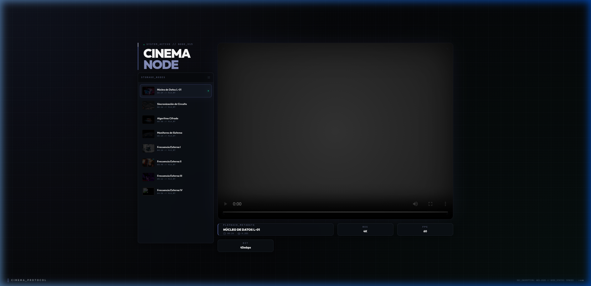

# 🎬 Día 15: Cinema Node Previewer (Industrial Station)

Bienvenido a la estación de monitoreo multimedia **Cinema Node**. Este proyecto implementa un previsualizador de video dinámico con una estética industrial "Pocket-Size", diseñado para funcionar en un entorno de alta densidad informativa (100vh).



## 📡 Características de la Estación
- **Layout Compacto (100vh):** Interfaz optimizada sin scroll, diseñada para terminales de control.
- **Enrutamiento Dinámico PHP 8.5:** Uso de la expresión `match` para la selección instantánea de nodos multimedia.
- **Data Inmutable:** Estructura de datos basada en `readonly class Video` para garantizar la integridad de las especificaciones técnicas.
- **Soporte Híbrido:** Reproducción fluida de archivos locales (`.mp4`) y streams externos de **YouTube** con detección automática.
- **HUD Industrial Premium:** Malla de rejilla técnica, brackets de enfoque y metadata técnica (RES, FPS, CODEC, BITRATE) integrada.

## 🛠️ Stack Tecnológico
- **Core:** PHP 8.5 (Strict Types).
- **Styling:** Tailwind CSS (Custom Industrial Theme).
- **Iconografía:** Phosphor Icons.
- **Fuentes:** Outfit & JetBrains Mono.

## 🚀 Instalación y Uso
1. Asegúrate de tener PHP 8.5 instalado.
2. Clona el repositorio y navega a la carpeta `dia-15-video-previewer`.
3. Inicia el servidor local:
   ```bash
   php -S localhost:8015 -t public/
   ```
4. Accede a `http://localhost:8015` en tu navegador.

## 🔍 Detalles Técnicos
El sistema utiliza un `AuthProtocol` simulado para la sincronización de nodos y permite el acceso externo a través de botones de derivación si el contenido está bloqueado por restricciones de embedding.

---
**Desplegado por:** BY_CHOKE_2026 // **Status:** OPERATIONAL
